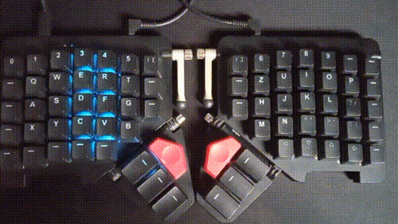
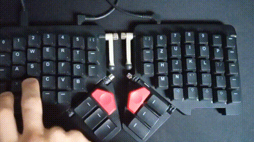
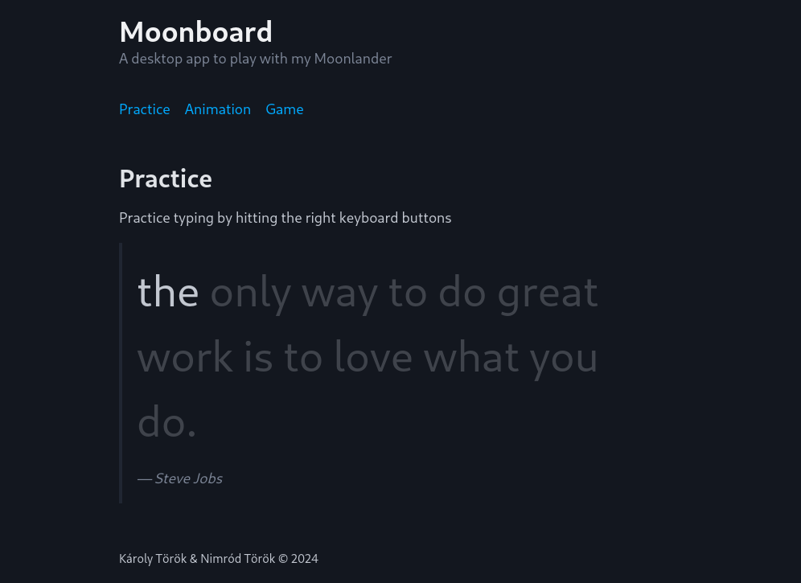

---
tags:
  - tauri
  - desktop
  - rust
date: 2024-10-11
---
Recently, I came across a library that provides API access to my Moonlander keyboard. It's written in Rust, so I saw it as the perfect opportunity to sharpen my skills! Plus, since my little one loves to pound away at the keys, I decided to build a fun, interactive desktop app. And just like that, the adventure begins...
## Library

It all started with the discovery of the [Kontroll](https://github.com/zsa/kontroll) library, maintained by the awesome team at [ZSA](https://www.zsa.io/). The library comes packed with plenty of examples, which sparked my interest. So, over the weekend, I decided to build a small library around it, complete with my own custom animations. What started as a simple project quickly evolved, and I kept adding new features as the scope grew.

The first challenge? The original examples were designed for the [Voyager](https://www.zsa.io/voyager), so I had to reverse-engineer the key layout for the Moonlander. Once I mapped out the layout, I could finally call the [Kontroll API](https://docs.rs/kontroll/latest/kontroll/) to light up individual keys. And from there, things got really exciting—because once you can light up a single key, the door opens to all kinds of cool animations!
```rust
pub const MODEL_LAYOUT: [[usize; 14]; 6] = [
    [  0,  1,  2,  3,  4,  5,  6,      36, 37, 38, 39, 40, 41, 42 ],
    [  7,  8,  9, 10, 11, 12, 13,      43, 44, 45, 46, 47, 48, 49 ],
    [ 14, 15, 16, 17, 18, 19, 20,      50, 51, 52, 53, 54, 55, 56 ],
    [ 21, 22, 23, 24, 25, 26, XX,      XX, 57, 58, 59, 60, 61, 62 ],
    [ 27, 28, 29, 30, 31, XX, XX,      XX, XX, 63, 64, 65, 66, 67 ],
    [ XX, XX, XX, 32, 33, 34, 35,      68, 69, 70, 71, XX, XX, XX ],
];

app.set_rgb_led(MODEL_LAYOUT[0][0], r, g, b, 0);
```
Here is the repo - https://github.com/karesztrk/moonboard/tree/master/src-tauri/moonsweeper





## Backend

At this point, I hit a roadblock.

> How can I create a user-friendly GUI?

Initially, I planned to go with a TUI (Text User Interface)—because, let's be honest, I'm a huge fan of terminal-based applications. But then, I had a lightbulb moment! Why not give [Tauri](https://tauri.app/) a shot?!

Tauri primarily uses Rust for the backend while leveraging standard HTML, CSS, and JavaScript for the frontend, making it perfect for building cross-platform desktop applications.

> Fun fact: According to their latest docs, Tauri now supports Swift and Kotlin for building mobile applications, too!

The backend structure turned out to be pretty straightforward: each animation maps to a registered `#[tauri::command]`. The only real challenge was initializing the Kontroll API asynchronously. The Tauri [docs](https://v2.tauri.app/develop/state-management/) didn't provide any clear guidance on how to handle state management asynchronously.
```rust
.setup(|app| {
	let handler_clone = app.handle().clone();
	async_runtime::spawn(async move {
		let api = Kontroll::new(None).await.unwrap();
		handler_clone.manage(AppState { api });
	});

	Ok(())
})
```
## Frontend
The magic of learning new frameworks did not stop here. I was already familiar with Svelte but i have never used it. So I tried to use its docs and various LLMs to quicly be learn it.
The prototype was done quickly but it was missing the framework conventions. Like various usages of the dollar ($) sign, the `lib` folder or the `store`.

I think most interesting part of the usage of State machines.  As always, i did not want to pull in a big library like [Xstate](https://stately.ai/docs/xstate-svelte) but rather implement something quick that can be used on my silly games. The state is distributed via Svelte stores to the components. You can check the source of the machine factory [here](https://github.com/karesztrk/moonboard/blob/master/src/lib/stores/machine.ts).

The magic of diving into new frameworks didn’t stop there. Although I had some familiarity with Svelte, I’d never actually used it in a project. So, I turned to its docs and a few helpful LLMs to quickly get up to speed.

The prototype came together fast, but I noticed it was missing some of Svelte's best practices—things like the various uses of the dollar (`$`) sign, the `$lib` folder structure, and the store for state management.

The most intriguing part for me was working with State Machines. As usual, I didn't want to bring in a bulky library like [Xstate](https://stately.ai/docs/xstate-svelte) when I could roll out something lightweight for my small-scale games. So, I built a simple state machine, with the state distributed to components using Svelte stores. If you're curious, you can check out the source of the machine factory [here](https://github.com/karesztrk/moonboard/blob/master/src/lib/stores/machine.ts).

```mermaid
stateDiagram
   direction LR
   [*] --> Idle
   Idle --> Running: START
   Running --> Paused: PAUSE
   Running --> Idle: STOP
   Running --> Finished: FINISH
   Paused --> Running: RESUME
   Paused --> Idle: STOP
   Finished --> [*]
```
For styling, I chose something that's perfect for quick prototyping: [Pico.css](https://picocss.com/). It’s lightweight, minimalistic, and fully responsive—plus, no need to deal with a mess of utility classes! 😛 It's super clean and gets the job done without fuss.

And voilà, here's the result!



## Reference
- https://github.com/zsa/kontroll
- https://docs.rs/kontroll/latest/kontroll/
- https://github.com/karesztrk/moonboard
- https://tauri.app/